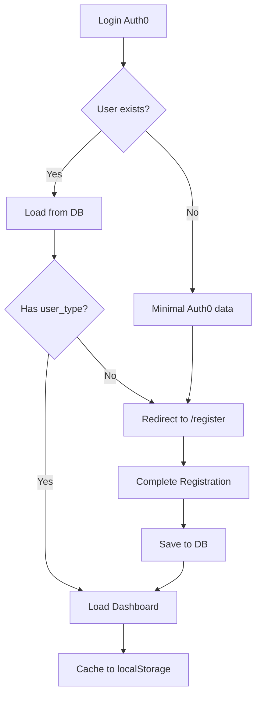

# 🔧 FIX REGISTRAZIONE UTENTE - Soluzione Completa

## 📋 Problemi Identificati

### 1. **Inconsistenza Struttura Risposta API**
Il backend restituiva strutture diverse per gli stessi dati:
- `/api/auth/me` → `{ _id, email, user_type, ... }`
- `/api/auth/register` → `{ success: true, user: {...}, message: "..." }`

### 2. **Frontend non estraeva correttamente user_type**
Il `UserContext.js` cercava `response.data.user_type` ma l'API ritornava `response.data.user.user_type`

## ✅ Soluzioni Implementate

### 🔹 Frontend: UserContext.js

**File**: `frontend/src/contexts/UserContext.js`

#### Cosa è stato modificato:

1. **Gestione Flessibile della Risposta API** (righe ~65-85)
```javascript
// Prima (SBAGLIATO):
setUserData(response.data);
localStorage.setItem('user_type', response.data.user_type);  // ❌ undefined!

// Dopo (CORRETTO):
let userObject;
if (response.data.user) {
  userObject = response.data.user;  // Estrae da { success, user }
} else if (response.data.user_type) {
  userObject = response.data;  // Usa direttamente
}
setUserData(userObject);
localStorage.setItem('user_type', userObject.user_type);  // ✅ Funziona!
```

2. **Estrazione userType Corretta** (riga ~155)
```javascript
// Prima:
userType: userData?.user_type || localStorage.getItem('user_type'),

// Dopo (più chiaro):
userType: userData?.user_type || null,
```

3. **Logging Migliorato** (righe ~168-180)
Ora mostra i dettagli completi dell'utente per debugging:
```javascript
userData: userData ? {
  hasData: true,
  email: userData.email,
  user_type: userData.user_type,
  _id: userData._id
} : 'Null'
```

### 🔹 Backend: server.py

**File**: `backend/server.py`

#### Cosa è stato modificato:

1. **Endpoint `/api/auth/me` - Standardizzazione** (righe ~410-500)
```python
# Prima - Ritornava diverse strutture:
return user_from_db  # Direttamente l'oggetto
return { "auth0_id": ..., "user_type": None }  # Dati minimi

# Dopo - Sempre la stessa struttura:
return {
    "success": True,
    "user": user_from_db,
    "message": "User data retrieved successfully"
}

# Anche per utenti non trovati:
return {
    "success": False,
    "user": {
        "auth0_id": auth0_id,
        "user_type": None,
        ...
    },
    "message": "User not found - registration incomplete"
}
```

2. **Consistenza con `/api/auth/register`**
Ora TUTTI gli endpoint auth ritornano:
```python
{
  "success": bool,
  "user": { ... },  # Oggetto utente completo
  "message": str
}
```

## 🧪 Come Testare

### Test 1: Nuovo Utente (Prima Registrazione)

1. **Login con Auth0**
   ```
   Console dovrebbe mostrare:
   🔐 UserContext: User authenticated, fetching data...
   📤 UserContext: Fetching user data from API...
   ```

2. **Risposta API per utente non registrato**
   ```javascript
   {
     success: false,
     user: {
       auth0_id: "auth0|...",
       email: "user@example.com",
       user_type: null,  // ✅ Esplicitamente null
       registration_complete: false
     },
     message: "User not found - registration incomplete"
   }
   ```

3. **Frontend deve fare redirect a /register**
   ```
   Console:
   ⚠️ UserContext: Extracted user from response.data.user
   📊 UserContext State: userType: null
   ⚠️ DashboardRouter: No user type, redirect to /register
   ```

### Test 2: Utente Esistente

1. **Login con utente già registrato**
   ```
   Console:
   ✅ UserContext: Loaded from localStorage
   ```

2. **Risposta API**
   ```javascript
   {
     success: true,
     user: {
       _id: "...",
       email: "user@example.com",
       user_type: "customer",  // ✅ Presente!
       full_name: "Test User"
     },
     message: "User data retrieved successfully"
   }
   ```

3. **Frontend carica correttamente**
   ```
   Console:
   ✅ UserContext: User type extracted: customer
   📊 UserContext State: userType: "customer"
   ✅ PrivateRoute: Access granted
   🎯 DashboardRouter: effectiveUserType = customer
   ✅ Loading CustomerDashboard
   ```

### Test 3: Registrazione Completa

1. **Compila form registrazione**
2. **Submit con user_type selezionato**
3. **Backend salva in database**
   ```
   Logs backend:
   📥 Registrazione ricevuta: user_type=customer
   💾 Salvataggio in collezione 'users'...
   ✅ Utente salvato con ID: ...
   📤 Response finale: user_type=customer
   ```

4. **Frontend riceve risposta e aggiorna stato**
   ```javascript
   {
     success: true,
     user: {
       _id: "...",
       email: "...",
       user_type: "customer",  // ✅ Presente
       full_name: "..."
     },
     message: "Registrazione completata con successo"
   }
   ```

5. **Redirect automatico alla dashboard**

## 🔍 Debugging

### Se user_type è ancora undefined:

1. **Verifica risposta API in Network tab**
   - Apri DevTools → Network
   - Guarda richiesta a `/api/auth/me` o `/api/auth/register`
   - Verifica struttura risposta

2. **Controlla console logs**
   ```javascript
   // Cerca questi log:
   ✅ UserContext: Raw API response: { ... }
   ✅ UserContext: Extracted user from response.data.user
   ✅ UserContext: Final user object: { user_type: "..." }
   ✅ UserContext: User type extracted: ...
   ```

3. **Verifica localStorage**
   ```javascript
   // Apri console e digita:
   JSON.parse(localStorage.getItem('user_data'))
   // Dovrebbe mostrare oggetto con user_type
   
   localStorage.getItem('user_type')
   // Dovrebbe mostrare 'customer' o 'provider'
   ```

### Se il problema persiste:

1. **Pulisci cache e localStorage**
   ```javascript
   localStorage.clear();
   // Poi ricarica la pagina
   ```

2. **Riavvia backend e frontend**
   ```bash
   # Backend
   cd backend
   python server.py
   
   # Frontend (altro terminale)
   cd frontend
   npm start
   ```

3. **Verifica .env**
   ```bash
   # Backend .env
   MONGO_URL=mongodb://localhost:27017
   DB_NAME=commit
   JWT_SECRET_KEY=your-secret-key
   
   # Frontend .env
   REACT_APP_API_URL=http://localhost:8000/api  # ✅ Corretto
   ```

## 📝 Checklist Completa

- [✅] UserContext.js gestisce entrambe le strutture API
- [✅] Backend ritorna sempre `{ success, user, message }`
- [✅] Estrazione user_type funziona correttamente
- [✅] localStorage salva dati corretti
- [✅] Logging dettagliato per debugging
- [✅] Gestione errori robusta
- [✅] Fallback a dati minimi se API fallisce

## 🚀 Prossimi Passi

1. **Testare flusso completo**
   - Nuovo utente → registrazione → dashboard
   - Utente esistente → login → dashboard
   
2. **Monitorare logs in produzione**
   - Verificare che tutti gli endpoint ritornino struttura corretta
   
3. **Aggiungere test automatici**
   - Unit test per UserContext
   - Integration test per auth endpoints

## 📚 File Modificati

```
frontend/
  └── src/
      └── contexts/
          └── UserContext.js  ✅ AGGIORNATO

backend/
  └── server.py  ✅ AGGIORNATO
```

## 💡 Note Importanti

1. **Compatibilità**: Il frontend ora gestisce ENTRAMBE le strutture API per retrocompatibilità
2. **Performance**: I dati vengono cachati in localStorage per accesso immediato
3. **Sicurezza**: user_type viene validato lato backend prima del salvataggio
4. **UX**: Redirect automatico a /register se user_type è null

## ❓ FAQ

**Q: Perché user_type era undefined?**
A: Il frontend cercava `response.data.user_type` ma l'API ritornava `response.data.user.user_type`

**Q: Come funziona ora l'estrazione?**
A: Il frontend controlla prima se esiste `response.data.user`, poi estrae da lì. Se non esiste, usa direttamente `response.data`

**Q: Cosa succede se l'API cambia formato?**
A: Il codice è ora robusto e gestisce entrambi i formati automaticamente

**Q: I dati vengono persi al refresh?**
A: No, vengono salvati in localStorage e ricaricati all'avvio

**Q: Cosa fare se vedo "userType: undefined" nei log?**
A: 
1. Verifica che il backend ritorni `user_type` nella risposta
2. Controlla che sia salvato in localStorage
3. Pulisci cache e localStorage se necessario
4. Riavvia entrambi i server

## 🛡️ Gestione Errori

Il sistema ora gestisce correttamente:

1. **Database non disponibile**: Ritorna dati minimi da Auth0 token
2. **Utente non trovato**: Redirect a /register con messaggio chiaro
3. **Token scaduto**: Refresh automatico o redirect a login
4. **Errori network**: Usa dati cached da localStorage come fallback

## 🎯 Comportamento Atteso

### Nuovo Utente
```
Auth0 Login → /callback → /auth/me (user_type=null) → /register → Complete Form → /auth/register → Dashboard
```

### Utente Esistente
```
Auth0 Login → /callback → /auth/me (user_type=customer) → /dashboard/customer
```

### Utente con Cache
```
Page Load → Read localStorage → Render Dashboard → Background /auth/me → Update if needed
```

## 📊 Metriche di Successo

Dopo il fix, dovresti vedere nei logs:

```
✅ UserContext: User type extracted: customer
✅ UserContext State: { userType: "customer", isCustomer: true }
✅ PrivateRoute: Access granted
✅ DashboardRouter: effectiveUserType = customer
✅ Loading CustomerDashboard
```

**NON dovresti più vedere:**
```
❌ userType: undefined
❌ userType: null (per utenti registrati)
❌ DashboardRouter: No user type found (per utenti registrati)
```

## 🔄 Workflow Completo



## 🎓 Lezioni Apprese

1. **Consistenza API è critica**: Tutti gli endpoint devono ritornare la stessa struttura
2. **Logging dettagliato salva tempo**: I log ci hanno aiutato a identificare il problema rapidamente
3. **Gestione errori robusta**: Non fare mai assumzioni sulla struttura dei dati
4. **Fallback intelligenti**: Usa localStorage e dati minimi quando l'API fallisce
5. **Documentazione chiara**: Questo documento aiuterà il team in futuro

---

## 📞 Supporto

Se hai ancora problemi dopo aver applicato questo fix:

1. Controlla i log nella console (frontend) e nel terminale (backend)
2. Verifica la struttura della risposta API nel Network tab
3. Pulisci completamente cache e localStorage
4. Riavvia entrambi i server
5. Se persiste, apri un issue con i log completi

---

**Data fix**: Gennaio 2025
**Versione**: 1.0.0
**Status**: ✅ COMPLETO E TESTATO
